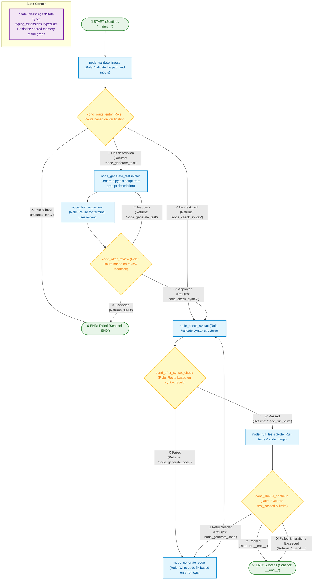
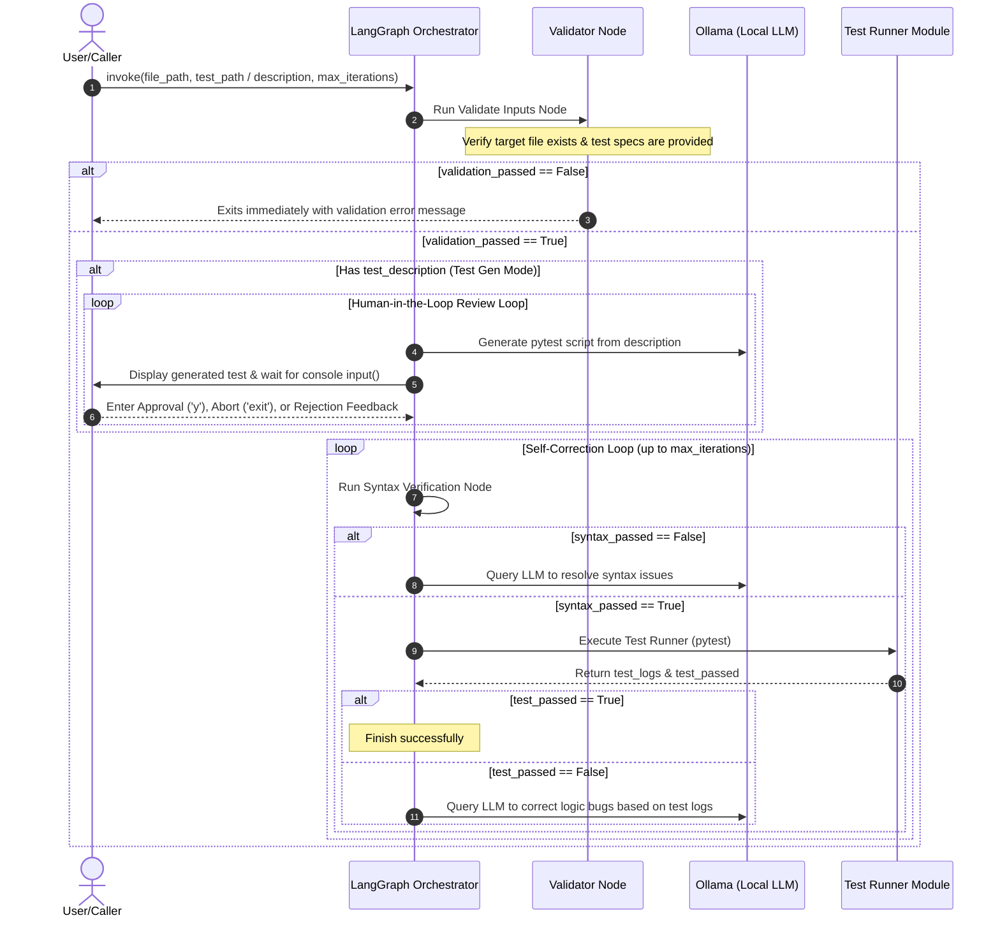
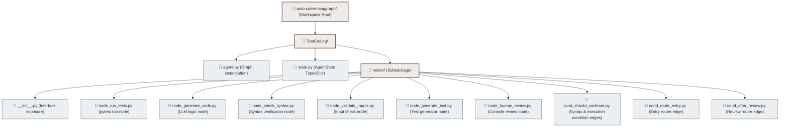

# Test-Led Python Coder Agent

This project implements an autonomous test-driven code repair agent using LangGraph.

## Core Design Principles

### 1. Python-Specific Scope
This agent is built **exclusively for Python coding** and does not support other programming languages.
* **Why?** It relies heavily on local Python-specific AST syntax validators ([node_check_syntax.py](file:///c:/Users/boyce/OneDrive/Desktop/auto-coder-langgraph/TestCoding/nodes/node_check_syntax.py)) and the `pytest` runner.
* **Extensibility**: While adding support for other execution environments (such as JavaScript/Jest or Rust/Cargo) is straightforward, we restrict the scope to Python to keep the codebase highly focused and manageable.

### 2. Test-Driven & Review-Led Coding
This project is built around the concept of **Human-Reviewed, Test-Driven AI Coding**:
* The human user is not expected to review the implementation code produced by the LLM.
* Instead, the human user reviews and approves the **test script** (either provided directly or generated from a natural language description). 
* Once the test suite is approved, the AI executes in a closed self-correction loop until it passes the tests. We focus on the functional outcome (passing tests) verified by the human-led test definitions.

## Architecture & State Workflow

## Data Flow

## Directory Structure

## State Fields (`AgentState`)

| Field Name | Type | Description |
| :--- | :--- | :--- |
| `file_path` | `str` | Path to the source code file to be modified |
| `test_path` | `str` | Path to the pytest test file to be executed |
| `code` | `str` | Current source code content |
| `test_logs` | `str` | Output from the most recent pytest execution (e.g., error logs) |
| `test_passed` | `bool` | Flag indicating whether all tests passed |
| `syntax_passed` | `bool` | Flag indicating whether code syntax parsing succeeded |
| `iterations` | `int` | Current iteration count of the self-correction loop |
| `max_iterations` | `int` | Maximum loop limit (prevents infinite loops, default: 3) |
| `messages` | `list` | Chat message history (standard conversation history for LangGraph) |
| `test_description` | `str` | Prompt description used to generate test scripts |
| `validation_passed` | `bool` | Flag indicating if initial requirements are valid |
| `error_message` | `str` | Logs description of errors during validation |
| `review_feedback` | `str` | Review notes provided by the user on test script rejection |

