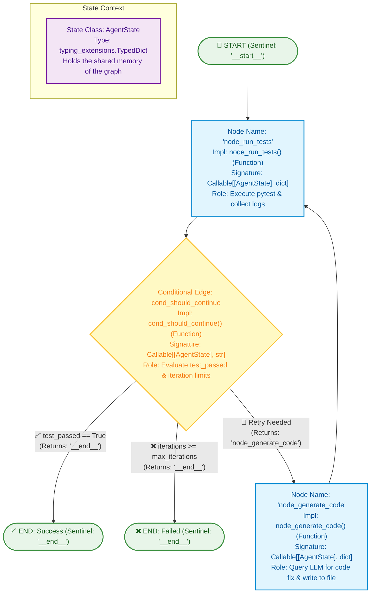
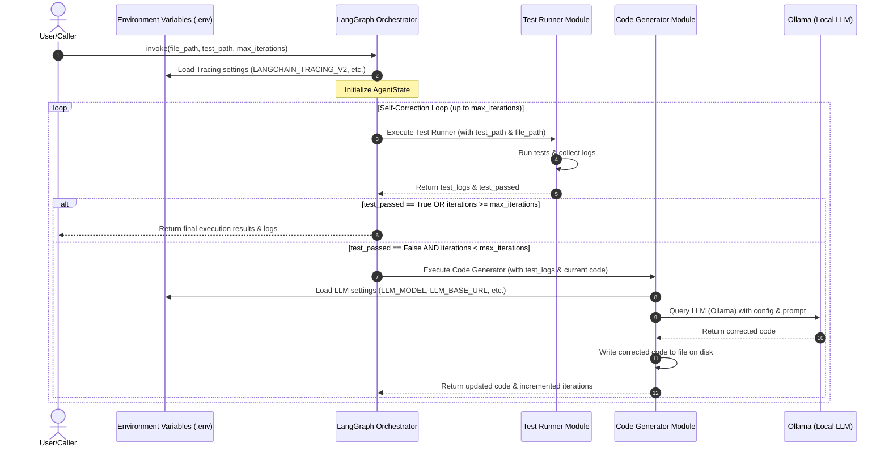
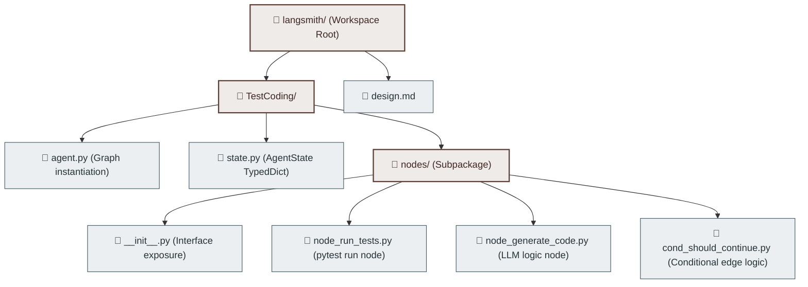

## Architecture & State Workflow

## Data Flow

## Directory Structure

## State Fields (`AgentState`)

| Field Name | Type | Description |
| :--- | :--- | :--- |
| `file_path` | `str` | Path to the source code file to be modified |
| `test_path` | `str` | Path to the pytest test file to be executed |
| `code` | `str` | Current source code content |
| `test_logs` | `str` | Output from the most recent pytest execution (e.g., error logs) |
| `test_passed` | `bool` | Flag indicating whether all tests passed |
| `iterations` | `int` | Current iteration count of the self-correction loop |
| `max_iterations` | `int` | Maximum loop limit (prevents infinite loops, default: 3) |
| `messages` | `list` | Chat message history (standard conversation history for LangGraph) |

