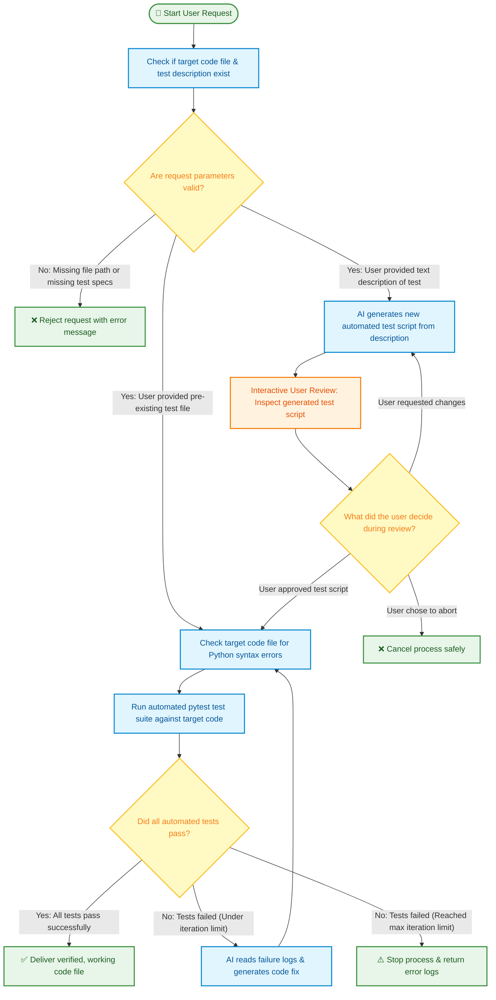

# Test-Led Python Coder Agent

Autonomous test-driven code generation and repair agent built with LangGraph.

---

## 1. Text Summarization

### Business Focus
* **Value Proposition**: For quick prototyping, developers often just need code that works without wanting to inspect or write complex inner implementation details. To significantly decrease the error rate of AI code generation, this project uses a **test-focused (or result-focused) approach**: the user specifies expected behaviors through tests (or prompt descriptions), allowing the AI to autonomously iterate in a closed loop until the code passes without requiring human review of implementation internals.
* **Target Outcomes**: Eliminates tedious manual debugging cycles, enforces outcome-driven software delivery, and guarantees working code verified by automated test results.
* **Core Functionality**:
  * **Dual Entry Modes**: Supports execution directly against pre-existing `pytest` test suites or via natural language prompt descriptions.
  * **Human-in-the-Loop Review**: Allows interactive terminal review, revision feedback, or approval of generated test scripts before code repair begins.
  * **Bounded Self-Correction**: Automatically generates, syntax-checks, and repairs code against test errors up to a specified maximum iteration limit.

### Tech Focus
* **Technology Stack & Frameworks**:
  *  **Python 3.10+**: Core programming environment and runtime.
  *  **LangGraph (`StateGraph`)**: Orchestrates agent workflow state machine and node transitions.
  *  **LangChain Core (`BaseMessage`)**: Manages chat message models and prompt structure.
  *  **Pytest Runner**: Executes automated test suites via isolated Python subprocesses.
  *  **Python AST (`ast.parse`)**: Performs local syntax parsing without running arbitrary code.
  *  **Python-Dotenv**: Manages local environment configurations and API keys.

* **Architecture & Capabilities**: Modular graph-based state machine leveraging a central `AgentState` (`TypedDict`). Features AST syntax validation, isolated test execution, and dynamic conditional routing (`cond_route_entry`, `cond_after_review`, `cond_after_syntax_check`, `cond_should_continue`).

---

## 2. Business Flow Mermaid Diagram

> **User-Friendly Guide**: This diagram explains what happens when a user submits a request to the agent, assuming zero prior context. Every step explicitly describes what is being checked, reviewed, or created.



---

## 3. Technical Architecture Mermaid Diagram

```mermaid
flowchart TD
    classDef stateBox fill:#f3e5f5,stroke:#7b1fa2,stroke-width:2px,color:#4a148c;
    classDef nodeBox fill:#e1f5fe,stroke:#0288d1,stroke-width:2px,color:#01579b;
    classDef condBox fill:#fff9c4,stroke:#fbc02d,stroke-width:2px,color:#f57f17;
    classDef startEnd fill:#e8f5e9,stroke:#388e3c,stroke-width:2px,color:#1b5e20;
    classDef subBox fill:#ffffff,stroke:#333333,stroke-width:1px,stroke-dasharray: 5 5;

    subgraph Memory["Shared State Schema: src/state.py"]
        AgentState["Class: AgentState(TypedDict)<br/>-----------------------------------<br/>file_path: str<br/>test_path: str<br/>code: str<br/>test_logs: str<br/>test_passed: bool<br/>syntax_passed: bool<br/>validation_passed: bool<br/>iterations: int<br/>max_iterations: int<br/>messages: Sequence[BaseMessage]<br/>review_feedback: str"]:::stateBox
    end

    START(["START"]):::startEnd --> node_validate_inputs

    subgraph GraphOrchestrator["Graph Orchestrator: src/agent.py (workflow = StateGraph(AgentState))"]

        subgraph SubValidate["Validation Component (src/nodes/node_validate_inputs.py)"]
            node_validate_inputs["node_validate_inputs(state: AgentState)<br/>• Verify target file_path exists<br/>• Verify test_path OR test_description provided<br/>• Sets validation_passed & error_message"]:::nodeBox
            cond_route_entry{"cond_route_entry(state: AgentState)<br/>[src/nodes/cond_route_entry.py]<br/>• Returns 'END', 'node_check_syntax',<br/>  or 'node_generate_test'"}:::condBox
        end

        subgraph SubTestGen["Test Generation & Human-in-the-Loop Component"]
            node_generate_test["node_generate_test(state: AgentState)<br/>[src/nodes/node_generate_test.py]<br/>• Invokes ChatOllama LLM<br/>• Writes generated pytest code to test_path"]:::nodeBox
            node_human_review["node_human_review(state: AgentState)<br/>[src/nodes/node_human_review.py]<br/>• Prompts console input for review<br/>• Records user approval ('y'), exit, or feedback"]:::nodeBox
            cond_after_review{"cond_after_review(state: AgentState)<br/>[src/nodes/cond_after_review.py]<br/>• Returns 'END', 'node_generate_test',<br/>  or 'node_check_syntax'"}:::condBox
        end

        subgraph SubSyntax["Syntax Checking Component"]
            node_check_syntax["node_check_syntax(state: AgentState)<br/>[src/nodes/node_check_syntax.py]<br/>• Parses code via ast.parse(code)<br/>• Updates syntax_passed & error_message"]:::nodeBox
            cond_after_syntax_check{"cond_after_syntax_check(state: AgentState)<br/>[src/nodes/cond_after_syntax_check.py]<br/>• Returns 'node_generate_code' (if failed)<br/>  or 'node_run_tests' (if passed)"}:::condBox
        end

        subgraph SubExecution["Test Execution & Repair Component"]
            node_run_tests["node_run_tests(state: AgentState)<br/>[src/nodes/node_run_tests.py]<br/>• Executes pytest subprocess.run()<br/>• Captures stdout/stderr into test_logs<br/>• Sets test_passed boolean"]:::nodeBox
            cond_should_continue{"cond_should_continue(state: AgentState)<br/>[src/nodes/cond_should_continue.py]<br/>• Evaluates test_passed & iterations limit<br/>• Returns END or 'node_generate_code'"}:::condBox
            node_generate_code["node_generate_code(state: AgentState)<br/>[src/nodes/node_generate_code.py]<br/>• Constructs fix prompt from test_logs<br/>• Invokes LLM & writes code repair to file_path<br/>• Increments iterations counter"]:::nodeBox
        end

    end

    class SubValidate,SubTestGen,SubSyntax,SubExecution subBox;

    node_validate_inputs --> cond_route_entry
    cond_route_entry -- "END" --> END_FAIL(["END"]):::startEnd
    cond_route_entry -- "node_generate_test" --> node_generate_test
    cond_route_entry -- "node_check_syntax" --> node_check_syntax

    node_generate_test --> node_human_review
    node_human_review --> cond_after_review
    cond_after_review -- "END" --> END_FAIL
    cond_after_review -- "node_generate_test" --> node_generate_test
    cond_after_review -- "node_check_syntax" --> node_check_syntax

    node_check_syntax --> cond_after_syntax_check
    cond_after_syntax_check -- "node_generate_code" --> node_generate_code
    cond_after_syntax_check -- "node_run_tests" --> node_run_tests

    node_generate_code --> node_check_syntax

    node_run_tests --> cond_should_continue
    cond_should_continue -- "END" --> END_SUCCESS(["END"]):::startEnd
    cond_should_continue -- "node_generate_code" --> node_generate_code
```



---

## 4. Technical & Business Logic Sequence Diagram

```mermaid
sequenceDiagram
    autonumber
    actor Caller as Caller / User
    participant Graph as src.agent.graph (StateGraph)
    participant Validate as node_validate_inputs()
    participant GenTest as node_generate_test()
    participant Review as node_human_review()
    participant Syntax as node_check_syntax()
    participant GenCode as node_generate_code()
    participant RunTests as node_run_tests()
    participant State as state: AgentState

    Caller->>Graph: graph.invoke(state: AgentState)
    Graph->>Validate: node_validate_inputs(state)
    Validate->>State: Update validation_passed & error_message

    rect rgb(255, 235, 238)
        alt validation_passed == False
            Validate-->>Graph: cond_route_entry() returns "END"
            Graph-->>Caller: Terminate with validation error
        end
    end

    rect rgb(255, 248, 225)
        alt has test_description (Test Generation Route)
            Graph->>GenTest: node_generate_test(state)
            GenTest->>State: Write generated test file & set test_path
            
            loop Human Review Loop
                Graph->>Review: node_human_review(state)
                Review->>Caller: Console prompt for approval/rejection feedback
                Caller-->>Review: User inputs 'y', 'exit', or feedback notes
                Review->>State: Update review_feedback
                
                alt cond_after_review() returns "END"
                    Review-->>Graph: Abort graph execution
                    Graph-->>Caller: Terminate workflow
                else cond_after_review() returns "node_generate_test"
                    Review->>GenTest: Regenerate test script using review_feedback
                end
            end
        end
    end

    rect rgb(232, 245, 233)
        loop Self-Correction Repair Loop (iterations < max_iterations)
            Graph->>Syntax: node_check_syntax(state)
            Syntax->>State: Update syntax_passed

            alt cond_after_syntax_check() returns "node_generate_code" (Syntax Error)
                Graph->>GenCode: node_generate_code(state)
                GenCode->>State: Update code & increment iterations
            else cond_after_syntax_check() returns "node_run_tests" (Syntax Valid)
                Graph->>RunTests: node_run_tests(state)
                RunTests->>State: Update test_logs & test_passed

                alt cond_should_continue() returns "END" (Tests Passed or Max Iterations Reached)
                    RunTests-->>Graph: Finish execution
                    Graph-->>Caller: Return final AgentState
                else cond_should_continue() returns "node_generate_code" (Tests Failed)
                    Graph->>GenCode: node_generate_code(state) using test_logs
                    GenCode->>State: Write code repair & increment iterations
                end
            end
        end
    end
