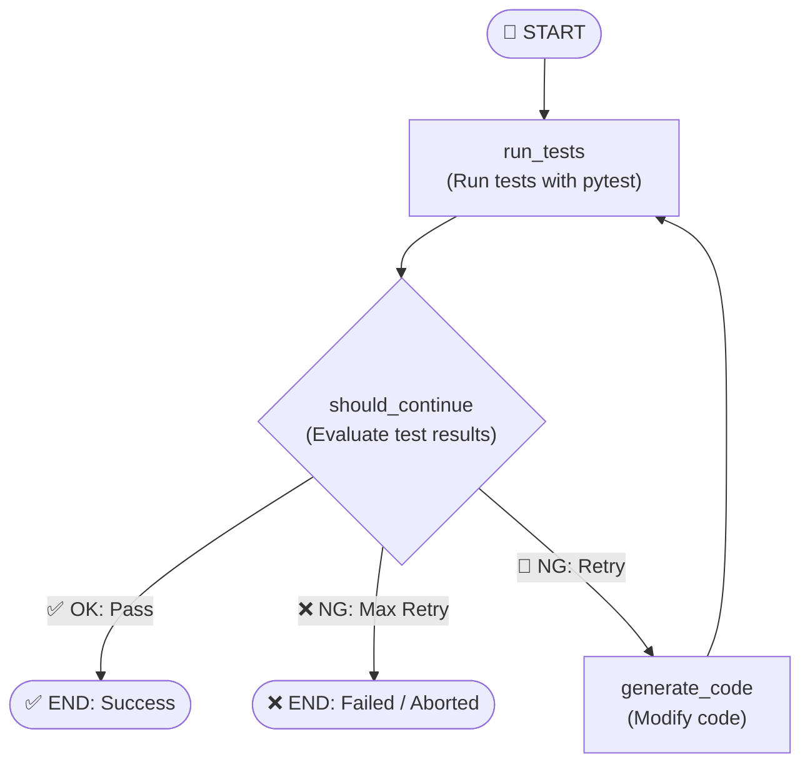

# Design Document: AutoRepairAgent (Self-Correction Loop)

This document describes the design, directory structure, and state management for the autonomous code repair agent.

## Agent Identity

* **Name**: `TestCoding`
* **Directory**: [TestCoding](file:///c:/Users/boyce/OneDrive/Desktop/langsmith/TestCoding)

---

## Terminology Guide

### 1. Code Generator (Code Generation & Modification)
* **Summary**: Takes the test failure logs and current code as input, and uses an LLM to repair bugs in the code.
* **Role**: Writes the corrected/modified code back to the original file.

### 2. Test Runner (pytest Execution)
* **Summary**: Runs pytest against the modified code.
* **Role**: Collects test execution logs and determines if the tests passed or failed.

---

## Architecture & State Workflow

---

## State Fields (`AgentState`)

| Field Name | Type | Description |
| :--- | :--- | :--- |
| `file_path` | `str` | Path to the source code file to be modified |
| `test_path` | `str` | Path to the pytest test file to be executed |
| `code` | `str` | Current source code content |
| `test_logs` | `str` | Output from the most recent pytest execution (e.g., error logs) |
| `test_passed` | `bool` | Flag indicating whether all tests passed |
| `iterations` | `int` | Current iteration count of the self-correction loop |
| `max_iterations` | `int` | Maximum loop limit (prevents infinite loops, default: 3) |
| `messages` | `list` | Chat message history (standard conversation history for LangGraph) |
